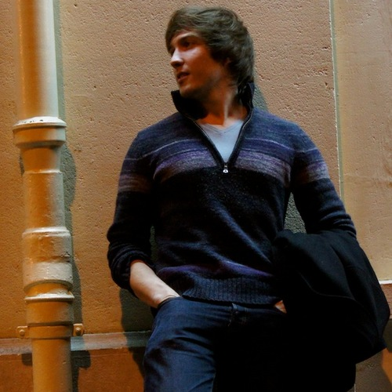

	

	
	

		
Hey there.

		
I'm a software engineer experienced in natural language processing, machine learning, and full-stack web development.

		
Want to chat? <a href='mailto:jdstuart@icloud.com?subject=hey there'>Hit me up.</a>

	

	

